# Attendance Application - React Native

Attendance application is a mobile application built with React Native that comfortable with `iOS` and `Android`. You can make attendance of particular class of institute. The app is designed to make online attendance more easy with QR code scanning technology only when faculty start the attendance. for security we have jwt authentication.

## Getting Started

### Prerequisites

To run Attendance application, you will need to have the following installed on your machine:

- Node.js
- npm
- React Native CLI

### Installation

1. Clone the repository
   ```
   git clone https://github.com/satish358/attendance-react-native-app.git
   ```
2. Navigate to the project directory:
   ```
   cd attendance-react-native-app
   ```
3. Install the dependencies:
   ```
   npm install
   ```

### Running the App

#### iOS

To run the app on an iOS simulator or device, run the following command:

```
npx react-native run-ios
```

This will start the app in the iOS simulator or on your connected iOS device, if you have one plugged in.

#### Android

To run the app on an Android emulator or device, run the following command:

```
npx react-native run-android
```

This will start the app in the Android emulator or on your connected Android device, if you have one plugged in.

### Debugging

To debug the app, you can use the built-in debugging tools in your browser. Simply open your web inspector, and you should see the app's code and console output.

Alternatively, you can use [React Native Debugger](https://github.com/jhen0409/react-native-debugger), which is a standalone debugging tool specifically designed for React Native apps.

## License

`MIT License`

I hope this helps you get started on your documentation! Let me know if you have any other questions.

## Screenshots

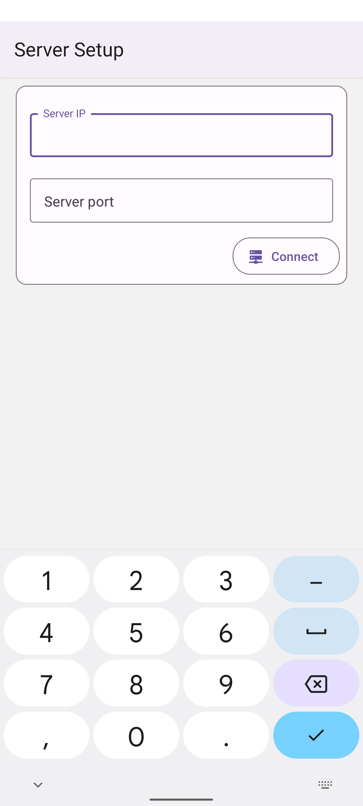
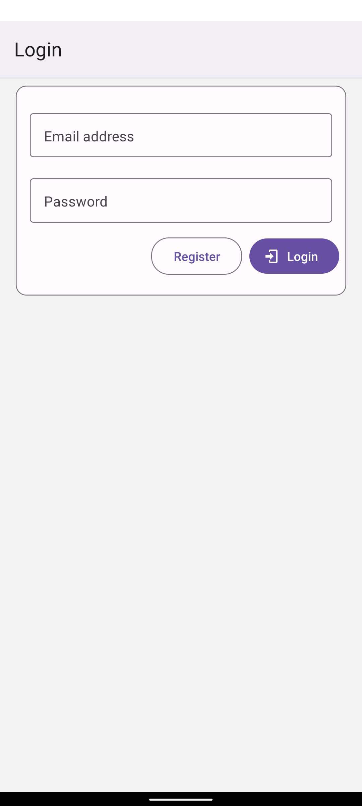
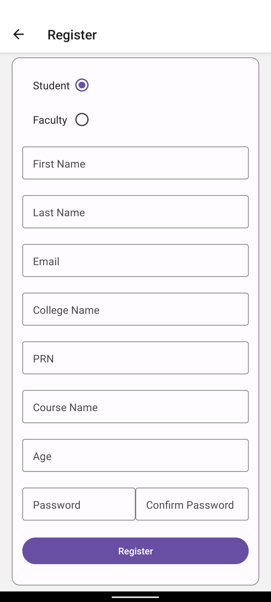
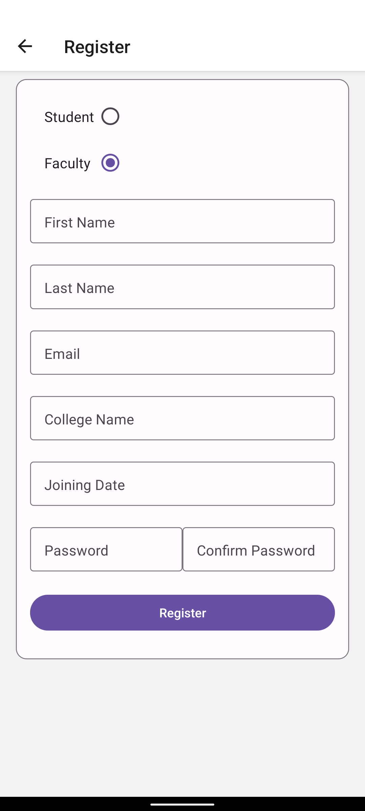
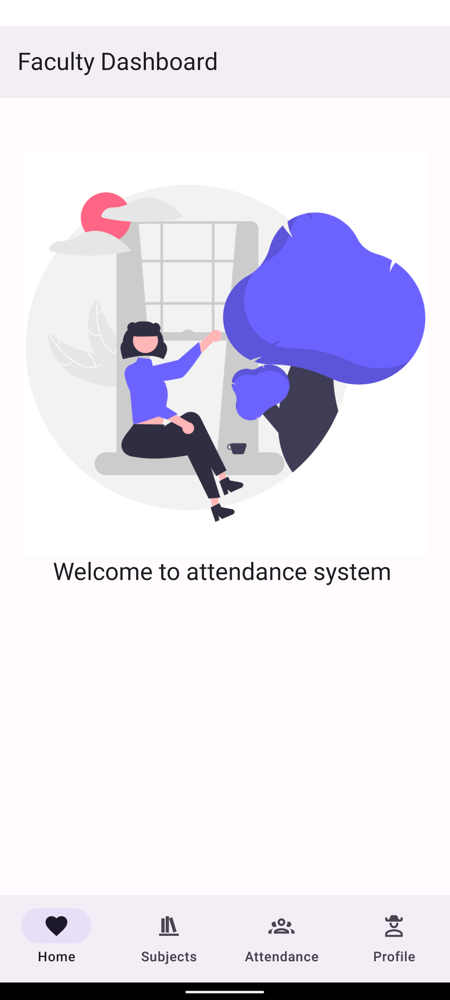
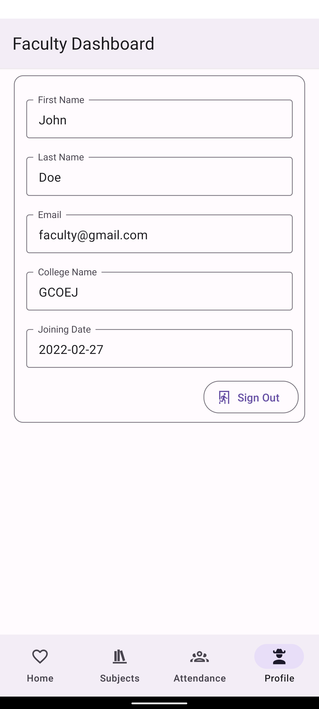
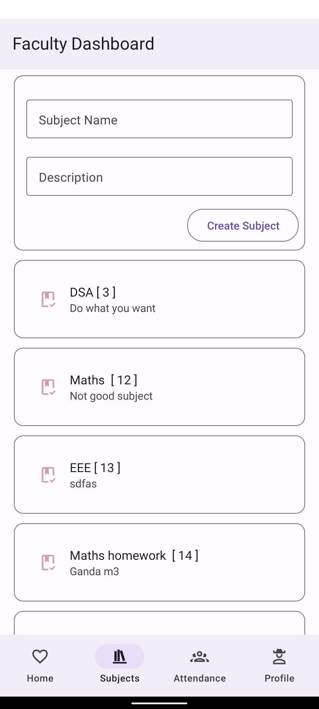
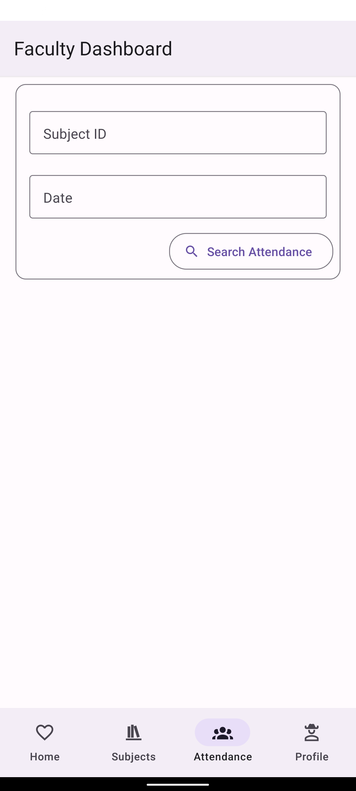
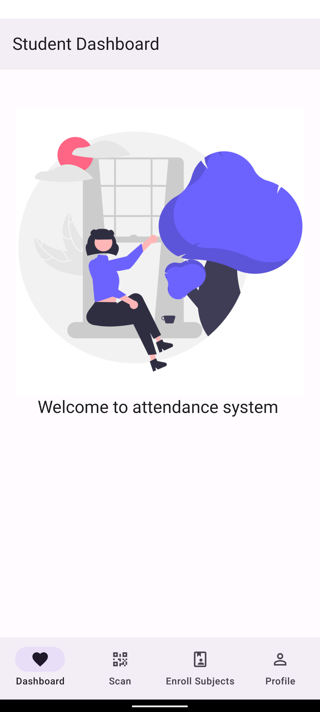
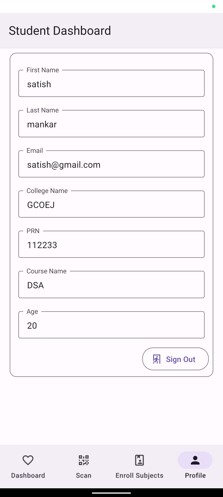
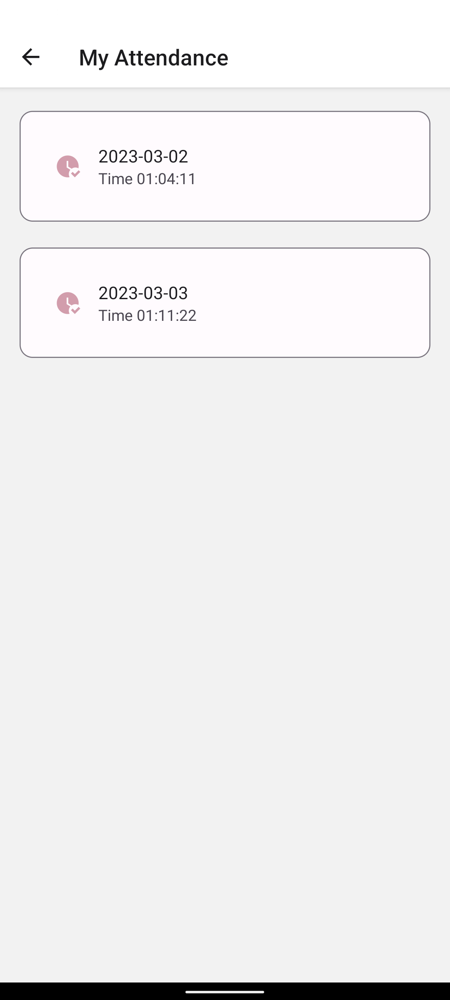
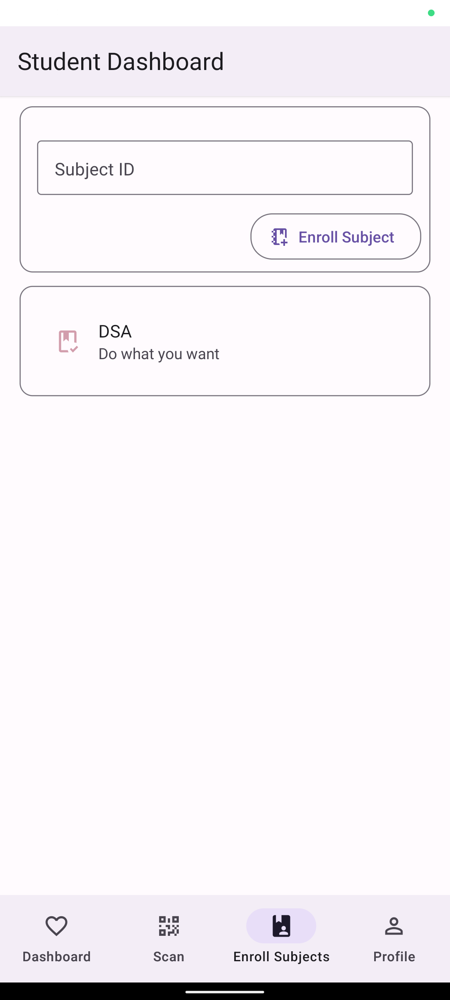
